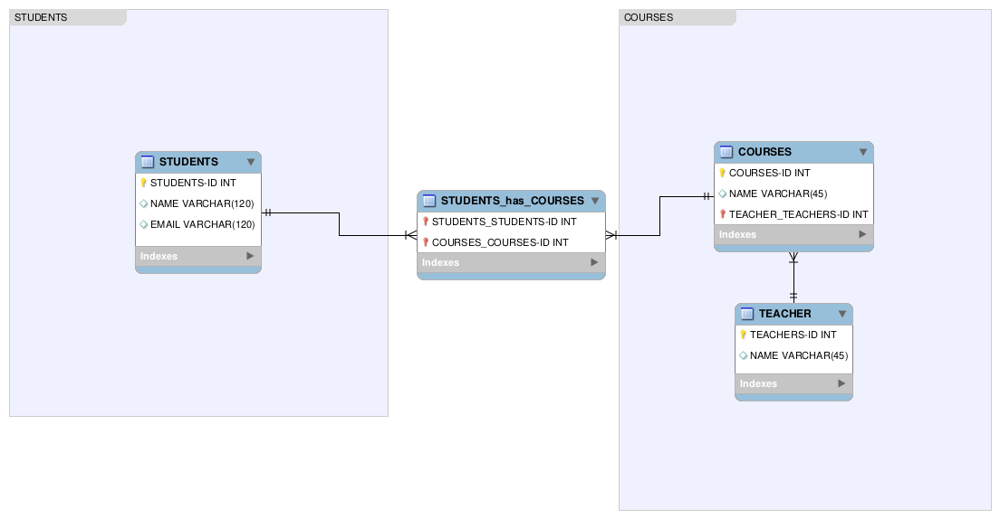
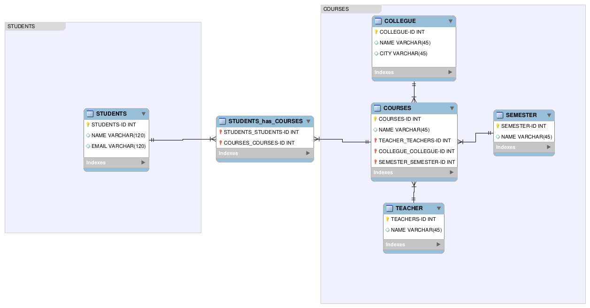

# SQL Normalization Activities - Leveling Up
> This activity was made by [Robinson Andres Cortes](https://github.com/andrescortesdev/)

Database normalization is a database schema design technique used to reduce data redundancy and eliminate undesirable dependencies by organizing data into well-structured tables.

The purpose of this activity is to improve and normalize a database schema by applying database normalization principles using a visual design tool. For this activity, you will use **MySQL Workbench**, a visual database design and modeling tool.

If you do not have MySQL Workbench installed, you can download it from the following link:  
[MySQL Community Downloads](https://dev.mysql.com/downloads/workbench/)

Also you must use the **Entity Relationship Diagram** (ERD) concepts in the schema.

For more information about **normalization** please click [here](https://www.w3schools.in/dbms/database-normalization).\
For more information about **ERD** please click in this videos: [Entity Relationship Diagram (ERD) Tutorial - Part 1](https://www.youtube.com/watch?v=xsg9BDiwiJE) and [Entity Relationship Diagram (ERD) Tutorial - Part 2: Primary keys, foreign keys, and bridge tables](https://www.youtube.com/watch?v=hktyW5Lp0Vo)

### Instructions
1. Download the provided **Excel file**, which contains the initial database structure.
2. Analyze the data and identify redundancies and dependencies.
3. Recreate and normalize the database schema using **MySQL Workbench** and apply **ERD** concepts.
4. Apply the appropriate normalization rules (e.g., 1NF, 2NF, 3NF).
5. Once finished, compare your normalized schema with mine (All the answers may differ, just make sure it follows the same logic).

### Expected Outcome
By completing this activity, you will be able to:
- Understand the principles of database normalization
- Design cleaner and more efficient database schemas
- Use MySQL Workbench for visual database modeling

## Level 1
Please download the **Excel file** by clicking [here](../../assets/sql-normalization/table-1.xlsx).\
Remember **normalize** the database applying **ERD** concepts.

    
Check if I’m right

    In this exercise, the main table is divided into three primary tables according to First Normal Form (1NF) principles.
    
    The first table stores all the students’ information and assigns each student a unique ID. The second table contains all the course information, also identified by its own ID. Finally, the third table stores the teachers’ information, again using a unique ID for each teacher.
    
    Now, let’s apply the ERD concepts:
    
    - A student can take many courses, and a course can have many students, which defines a many-to-many relationship.
    - A course can only have one teacher, but a teacher can teach many courses, which defines a one-to-many relationship.
    
    With all of this in mind, here is the final result:

      

## Level 2
Please download the **Excel file** by clicking [here](../../assets/sql-normalization/table-2.xlsx).\
Remember **normalize** the database applying **ERD** concepts.

    
Am I genious?

    In this exersice the complexity grows, so let me explain it step by step.
    
    First of all we have to divide the database in concepts, the first concept in the student and the second concept is the courses, but the course is own by a college, the course is in a semester and the course have a teacher.
    
    And that is how I divided the table, into related tables. But what about the relationships, here we are:
    
    - The students are related with the courses, a student could take many courses and a courses could have many students. Many to Many relationship.
    - The course is own by a college, the course could only be own by one college, but the college could own many courses. One to Many relationship.
    - The course is in a semester, the course could only be in one semester but the semester could have a lot of courses. One to Many relationship.
    - And a course is teach by a teacher, the course could only be taught by one teacher, but the teacher could teach many courses. One to Many relationship.
    
    With all of this, here is my solution:

      

## Level 3
Please download the **Excel file** by clicking [here](../../assets/sql-normalization/table-3.xlsx).\
Remember **normalize** the database applying **ERD** concepts.

    
Let’s see…

    Let's break down this table into three main concepts, the clients, the orders and the products, each product have cathegories and suppliers.
    
    With this divitions, let's see the relationships:
    
      - Client can do a lot of orders, but one order only can be own by one client. One to Many relationship.
      - An order could have many products and a products could be in a lot of order. Many to Many relationship.
      - One product could only be supplie by one supplier, but one supplier could supplie many products. One to Many relationship.
      - And a categorie could have many products and a product could have many categories. Many to Many relationship.
      
    Having these into count, here is the solution:

      

## Level 4
Please download the **Excel file** by clicking [here](../../assets/sql-normalization/table-4.xlsx).\
Remember **normalize** the database applying **ERD** concepts.

    
Did I nail it?

    Finally we are in the last one and more complex.
    
    In this case I dicided to divided the table into three main concepts, the first one is the users, and a user lives in a city. The second is the products, the products are divided into categories and they are often place in orders. And last but not least the organizations.
    
    Here are the relatioships:
    
    - A user could only work in one organization, but an organization could have a lot of employees. One to Many relationship.
    - A user could place many orders, but an order only could be own by one user. One to Many relationship.
    - An order could have many products and a product could be in many orders. Many to Many relationship.
    - Ans a product could have many categories and a categories could have many products. Many to Many relationship.

    With that in mind, here is the solution:

      

