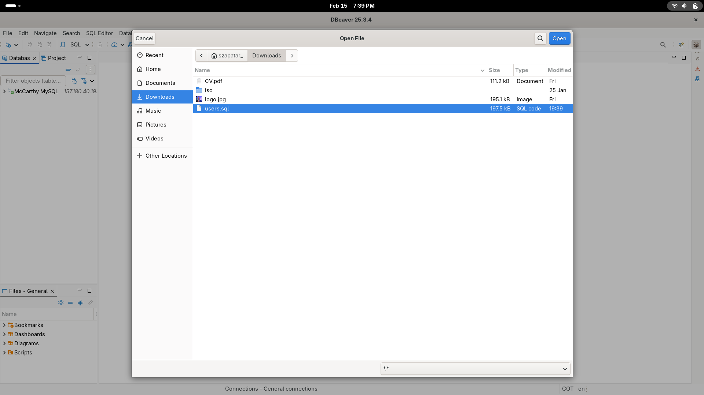

# Descargar y configurar la base de datos SQL
- Puedes encontrar la actividad aquí: [Ir a la actividad](../../activities/sql/progressive-sql-activity)
- Si no sabes cómo crear una base de datos usando MySQL, puedes ver este video: [Cómo crear una base de datos en MySQL](https://www.youtube.com/watch?v=wgRwITQHszU)
- Este es el archivo que necesitas descargar para completar la actividad: [Descargar el archivo SQL](./users.sql)

Después de descargar el archivo, abre tu gestor de bases de datos (DBMS) favorito y carga el archivo SQL. A continuación se muestra un ejemplo usando DBeaver:

Una vez que el archivo esté abierto, verás todo el código SQL que debe ejecutarse. Para mantener todo organizado, recomiendo colapsar las secciones.

Antes de ejecutar el código, asegúrate de:
1. Seleccionar tu servidor
2. Seleccionar la base de datos de destino

Luego ejecuta el script:

Ahora ya tienes todo listo para comenzar.
