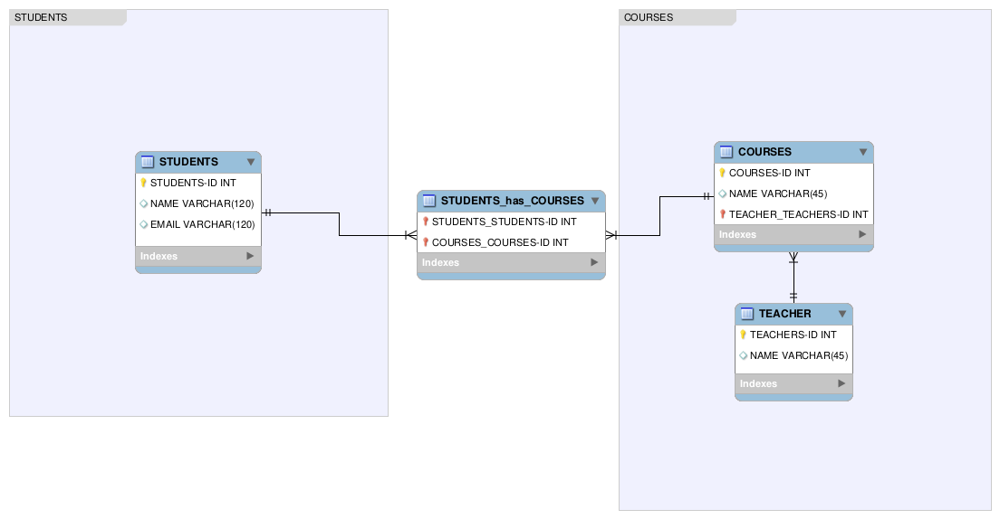

# Actividades de Normalización SQL - Subiendo de Nivel
> Esta actividad fue creada por [Robinson Andres Cortes](https://github.com/andrescortesdev/)

La normalización de bases de datos es una técnica de diseño de esquemas que se utiliza para reducir la redundancia de datos y eliminar dependencias no deseadas, organizando la información en tablas bien estructuradas.

El propósito de esta actividad es mejorar y normalizar un esquema de base de datos aplicando principios de normalización mediante una herramienta de diseño visual. Para esta actividad, utilizarás **MySQL Workbench**, una herramienta visual para el diseño y modelado de bases de datos.

Si no tienes MySQL Workbench instalado, puedes descargarlo desde el siguiente enlace:  
[Descargas de MySQL Community](https://dev.mysql.com/downloads/workbench/)

Además, debes utilizar los conceptos de **Diagrama Entidad–Relación** (ERD) en el esquema.

Para más información sobre **normalización**, haz clic [aquí](https://www.w3schools.in/dbms/database-normalization).\
Para más información sobre **ERD**, por favor revisa estos videos:  
[Entity Relationship Diagram (ERD) Tutorial - Part 1](https://www.youtube.com/watch?v=xsg9BDiwiJE) y  
[Entity Relationship Diagram (ERD) Tutorial - Part 2: Primary keys, foreign keys, and bridge tables](https://www.youtube.com/watch?v=hktyW5Lp0Vo)

### Instrucciones
1. Descarga el **archivo de Excel** proporcionado, el cual contiene la estructura inicial de la base de datos.
2. Analiza los datos e identifica redundancias y dependencias.
3. Recrea y normaliza el esquema de la base de datos usando **MySQL Workbench** y aplica conceptos de **ERD**.
4. Aplica las reglas de normalización correspondientes (por ejemplo, 1NF, 2NF, 3NF).
5. Una vez finalizado, compara tu esquema normalizado con la solución proporcionada para verificar su corrección.

### Resultado Esperado
Al completar esta actividad, podrás:
- Comprender los principios de la normalización de bases de datos
- Diseñar esquemas de bases de datos más limpios y eficientes
- Utilizar MySQL Workbench para el modelado visual de bases de datos

## Nivel 1
Por favor descarga el **archivo de Excel** haciendo clic [aquí](../../assets/sql-normalization/table-1.xlsx).\
Recuerda **normalizar** la base de datos aplicando conceptos de **ERD**.

    
Verificar si estoy en lo correcto

      

