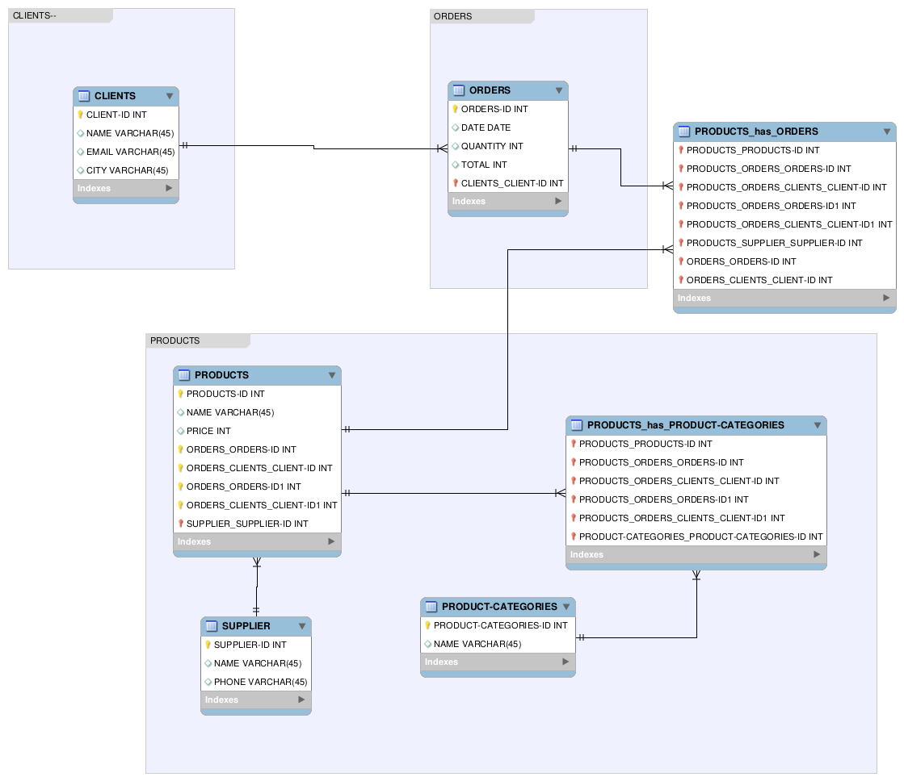
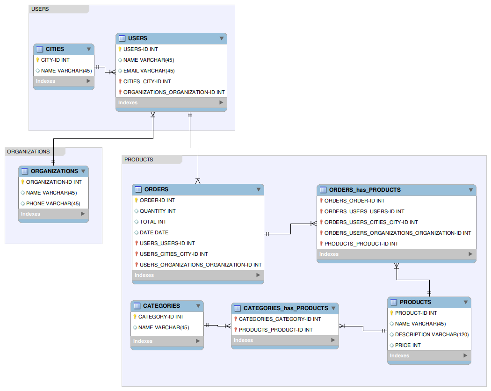

# Actividades de Normalización SQL - Subiendo de Nivel
> Esta actividad fue creada por [Robinson Andres Cortes](https://github.com/andrescortesdev/)

La normalización de bases de datos es una técnica de diseño de esquemas que se utiliza para reducir la redundancia de datos y eliminar dependencias no deseadas, organizando la información en tablas bien estructuradas.

El propósito de esta actividad es mejorar y normalizar un esquema de base de datos aplicando principios de normalización mediante una herramienta de diseño visual. Para esta actividad, utilizarás **MySQL Workbench**, una herramienta visual para el diseño y modelado de bases de datos.

Si no tienes MySQL Workbench instalado, puedes descargarlo desde el siguiente enlace:  
[Descargas de MySQL Community](https://dev.mysql.com/downloads/workbench/)

Además, debes utilizar los conceptos de **Diagrama Entidad–Relación** (ERD) en el esquema.

Para más información sobre **normalización**, haz clic [aquí](https://www.w3schools.in/dbms/database-normalization).\
Para más información sobre **ERD**, por favor revisa estos videos:  
[Entity Relationship Diagram (ERD) Tutorial - Part 1](https://www.youtube.com/watch?v=xsg9BDiwiJE) y  
[Entity Relationship Diagram (ERD) Tutorial - Part 2: Primary keys, foreign keys, and bridge tables](https://www.youtube.com/watch?v=hktyW5Lp0Vo)

### Instrucciones
1. Descarga el **archivo de Excel** proporcionado, el cual contiene la estructura inicial de la base de datos.
2. Analiza los datos e identifica redundancias y dependencias.
3. Recrea y normaliza el esquema de la base de datos usando **MySQL Workbench** y aplica conceptos de **ERD**.
4. Aplica las reglas de normalización correspondientes (por ejemplo, 1NF, 2NF, 3NF).
5. Una vez finalizado, compara tu esquema normalizado mi solucion (Todas la soluciones pueden variar, solo asegurate que siga la misma logica).

### Resultado Esperado
Al completar esta actividad, podrás:
- Comprender los principios de la normalización de bases de datos
- Diseñar esquemas de bases de datos más limpios y eficientes
- Utilizar MySQL Workbench para el modelado visual de bases de datos

## Nivel 1
Por favor descarga el **archivo de Excel** haciendo clic [aquí](../../assets/sql-normalization/table-1.xlsx).\
Recuerda **normalizar** la base de datos aplicando conceptos de **ERD**.

    
Verificar si estoy en lo correcto

    
    En este ejercicio, la tabla principal se divide en tres tablas primarias de acuerdo con los principios de la **Primera Forma Normal (1NF)**.
    
    La primera tabla almacena toda la información de los estudiantes y asigna a cada uno un ID único. La segunda tabla contiene toda la información de los cursos, también identificada por su propio ID. Finalmente, la tercera tabla almacena la información de los profesores, nuevamente utilizando un ID único para cada profesor.
    
    Ahora, apliquemos los conceptos de **ERD (Diagrama Entidad–Relación)**:
    
    - Un estudiante puede tomar muchos cursos, y un curso puede tener muchos estudiantes, lo que define una relación **muchos a muchos**.
    - Un curso solo puede tener un profesor, pero un profesor puede enseñar muchos cursos, lo que define una relación **uno a muchos**.
    
    Teniendo todo esto en cuenta, este es el resultado final:

      

## Nivel 2
Por favor descarga el **archivo de Excel** haciendo clic [aquí](../../assets/sql-normalization/table-2.xlsx).\
Recuerda **normalizar** la base de datos aplicando conceptos de **ERD**.

    
¿Soy un genio?

    En este ejercicio la complejidad aumenta, así que permíteme explicarlo paso a paso.
        
    Primero que todo, debemos dividir la base de datos en conceptos. El primer concepto son los estudiantes y el segundo concepto son los cursos. Sin embargo, cada curso pertenece a una universidad, se dicta en un semestre y tiene un profesor.
        
    Así es como dividí la tabla en tablas relacionadas. Pero, ¿qué hay de las relaciones? Aquí están:
        
    - Los estudiantes están relacionados con los cursos: un estudiante puede tomar muchos cursos y un curso puede tener muchos estudiantes. Relación Muchos a Muchos.
    - El curso pertenece a una universidad: un curso solo puede pertenecer a una universidad, pero una universidad puede tener muchos cursos. Relación Uno a Muchos.
    - El curso se dicta en un semestre: un curso solo puede estar en un semestre, pero un semestre puede tener muchos cursos. Relación Uno a Muchos.
    - Y un curso es dictado por un profesor: un curso solo puede ser dictado por un profesor, pero un profesor puede dictar muchos cursos. Relación Uno a Muchos.
        
    Con todo esto, aquí está mi solución:

      

## Nivel 3
Por favor descarga el **archivo de Excel** haciendo clic [aquí](../../assets/sql-normalization/table-3.xlsx).\
Recuerda **normalizar** la base de datos aplicando conceptos de **ERD**.

    
Veamos...

    Vamos a dividir esta tabla en tres conceptos principales: los clientes, los pedidos y los productos. Cada producto tiene categorías y proveedores.
        
    Con estas divisiones, veamos las relaciones:
        
    - Un cliente puede realizar muchos pedidos, pero un pedido solo puede pertenecer a un cliente. Relación Uno a Muchos.
    - Un pedido puede tener muchos productos y un producto puede estar en muchos pedidos. Relación Muchos a Muchos.
    - Un producto solo puede ser suministrado por un proveedor, pero un proveedor puede suministrar muchos productos. Relación Uno a Muchos.
    - Y una categoría puede tener muchos productos, y un producto puede tener muchas categorías. Relación Muchos a Muchos.
          
    Teniendo todo esto en cuenta, aquí está la solución:
    
    

## Nivel 4
Por favor descarga el **archivo de Excel** haciendo clic [aquí](../../assets/sql-normalization/table-4.xlsx).\
Recuerda **normalizar** la base de datos aplicando conceptos de **ERD**.

    
¿Lo hice bien?

    Finalmente llegamos al último nivel, y también al más complejo.
        
    En este caso, decidí dividir la tabla en tres conceptos principales. El primero son los usuarios, y cada usuario vive en una ciudad. El segundo son los productos; los productos se dividen en categorías y suelen formar parte de pedidos. Y por último, pero no menos importante, las organizaciones.
        
    Estas son las relaciones:
        
    - Un usuario solo puede trabajar en una organización, pero una organización puede tener muchos empleados. Relación Uno a Muchos.
    - Un usuario puede realizar muchos pedidos, pero un pedido solo puede pertenecer a un usuario. Relación Uno a Muchos.
    - Un pedido puede tener muchos productos y un producto puede estar en muchos pedidos. Relación Muchos a Muchos.
    - Y un producto puede tener muchas categorías, y una categoría puede tener muchos productos. Relación Muchos a Muchos.
    
    Con esto en mente, aquí está la solución:
    
    

